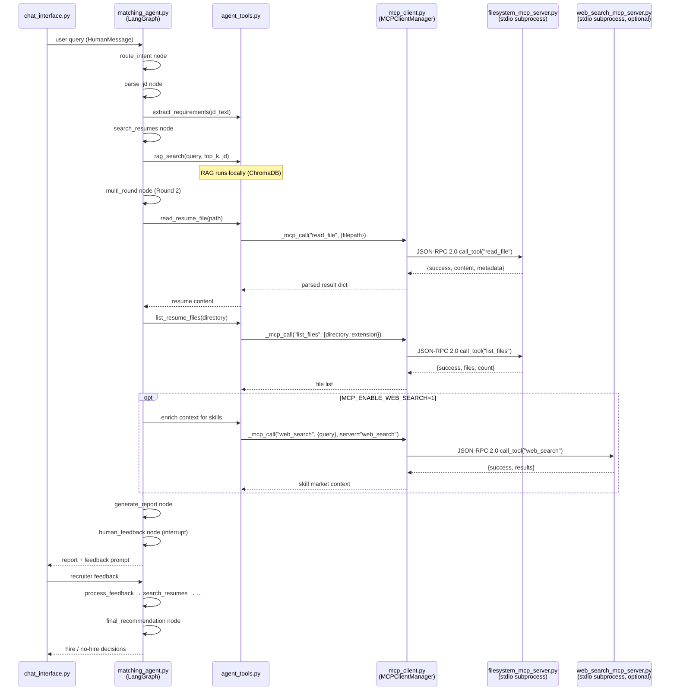
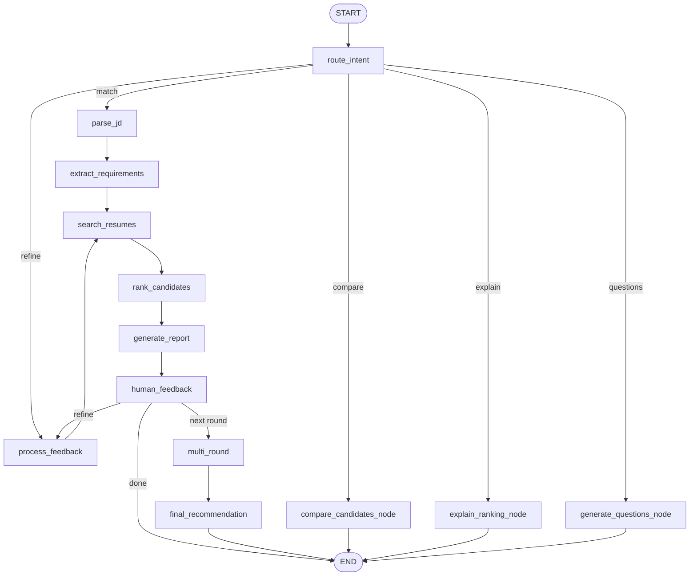

# LLM Resume Assistant, RAG Matching & LangGraph Agent

Python project for resume file operations via LLM tool-calling, a semantic search pipeline that matches candidates to job descriptions using Gemini embeddings and ChromaDB, and a LangGraph-based conversational matching agent with multi-round screening and a human-in-the-loop feedback loop.

## Features

### LLM File Assistant (Milestone 1)
- Read resume files (TXT, PDF, DOCX) with metadata
- List and search files within a configurable base directory
- Write files with atomic writes and overwrite protection
- Multi-step LLM tool-calling for natural language tasks

### RAG Resume Matching (Milestone 2)
- Section-aware resume chunking (basics, education, work experience)
- Gemini embedding generation with retry on rate limits
- ChromaDB vector storage at `data/chroma_db/`
- Hybrid matching: 70% semantic similarity + 30% keyword/requirement boost
- JSON output with match scores, matched skills, excerpts, and reasoning

### LangGraph Matching Agent (Milestone 3)
- Conversational interface accepting natural language queries
- Stateful graph tracking conversation history, requirements, shortlist, and ranking snapshots
- Multi-round screening: broad search (top 10) -> deep analysis -> hire/no-hire recommendation
- Human-in-the-loop feedback loop using LangGraph `interrupt()` for iterative refinement
- Explainability: detailed match reports with strengths, gaps, and improvement suggestions for borderline candidates
- Agent tools: `rag_search`, `extract_requirements`, `compare_candidates`, `generate_interview_questions`, plus Milestone 1 file tools

## Project Structure

```
llm-fs/
├── fs_tools.py              # Milestone 1: File system tools (read, list, search, write)
├── llm_file_assistant.py    # Milestone 1: LLM tool-calling assistant and CLI
├── resume_rag.py            # Milestone 2: Chunking, embeddings, ChromaDB vector store
├── job_matcher.py           # Milestone 2: Semantic and hybrid resume-to-job matching
├── agent_tools.py           # Milestone 3: Tool layer (RAG search, requirements, compare, questions)
├── matching_agent.py        # Milestone 3: LangGraph agent (state, nodes, graph)
├── chat_interface.py        # Milestone 3: CLI chat with demo scenarios
├── filesystem_mcp_server.py # Milestone 4: MCP server exposing all file tools + watch/batch
├── web_search_mcp_server.py # Milestone 4 (bonus): Mock web-search MCP server
├── mcp_client.py            # Milestone 4: Async MCP client + sync manager for agents
├── test_mcp.py              # Milestone 4: MCP test scenarios (7 scenario classes)
├── data_generator.py        # Synthetic resume and job description data
├── example_usage.py         # End-to-end usage demo
├── analysis.ipynb           # Metrics, latency analysis, visualizations
├── start.sh                 # One-command setup and pipeline runner
├── requirements.txt
├── .env.example
└── data/
    ├── synthetic_resumes/   # 30 JSON resumes
    ├── job_descriptions/    # 5 JSON job descriptions
    └── chroma_db/           # Vector store (auto-created, gitignored)
```

## Setup

1. Create and activate a virtual environment:

```bash
python -m venv venv
source venv/bin/activate
```

2. Install dependencies:

```bash
pip install -r requirements.txt
```

3. Configure environment variables:

```bash
cp .env.example .env
# Edit .env and set GEMINI_API_KEY
```

## Environment Variables

| Variable | Description |
|----------|-------------|
| `GEMINI_API_KEY` | Google Gemini API key (required for embeddings and LLM assistant) |
| `GEMINI_MODEL` | Gemini model name. Default: `gemini-2.5-flash` |
| `USE_LOCAL_EMBEDDINGS` | Set to `1` for offline local embeddings (testing only) |
| `FILE_ASSISTANT_BASE_DIR` | Base directory for file operations. Default: current directory |
| `FILE_ASSISTANT_MAX_BYTES` | Max file size for reads. Default: `5000000` |
| `FILE_ASSISTANT_MAX_CHARS` | Max characters returned by `read_file`. Default: `200000` |
| `LLM_TOOL_MAX_CALLS` | Max tool-call iterations per query. Default: `6` |
| `MATCHING_AGENT_RESUME_DIR` | Resume directory for the agent. Default: `data/synthetic_resumes` |
| `MATCHING_AGENT_JD_DIR` | Job description directory for the agent. Default: `data/job_descriptions` |
| `MATCHING_AGENT_CHROMA_DIR` | Vector store directory for the agent. Default: `data/chroma_db` |
| `MCP_TRANSPORT` | MCP server transport: `stdio` (default) or `streamable-http` |
| `MCP_HOST` | Host for HTTP transport. Default: `127.0.0.1` |
| `MCP_PORT` | Port for HTTP transport. Default: `8765` |
| `MCP_FILESYSTEM_SERVER` | Absolute path to `filesystem_mcp_server.py`. Default: auto-detected |
| `MCP_WEB_SEARCH_SERVER` | Absolute path to `web_search_mcp_server.py`. Default: auto-detected |
| `MCP_ENABLE_WEB_SEARCH` | Set to `1` to enable the web-search MCP server in the agent. Default: `0` |
| `MCP_WATCH_POLL_INTERVAL` | Polling interval (seconds) for `watch_directory`. Default: `1.0` |

All entry points (CLI, RAG modules, and the LangGraph agent) load `.env` automatically on startup, so `export` is not required when a `.env` file is present.

## Usage

### LLM File Assistant

```bash
venv/bin/python llm_file_assistant.py "Read all resumes in the samples folder"
venv/bin/python llm_file_assistant.py "Find resumes mentioning cashier"
venv/bin/python llm_file_assistant.py "Create a summary file for samples/resume_009.docx"
```

All file paths are restricted to `FILE_ASSISTANT_BASE_DIR`. Set this to a dedicated folder for production use.

### RAG Matching Pipeline

Run the full pipeline (setup, index resumes, match jobs):

```bash
./start.sh
```

Or run each step manually:

```bash
venv/bin/python resume_rag.py      # Index resumes into ChromaDB
venv/bin/python job_matcher.py     # Match job descriptions; saves data/matching_results.json
venv/bin/python example_usage.py   # End-to-end demo
```

Generate fresh synthetic data:

```bash
venv/bin/python data_generator.py
```

### MCP Server (Milestone 4)

The filesystem MCP server exposes all Milestone 1 file tools plus `watch_directory` and `batch_process` over the Model Context Protocol (JSON-RPC 2.0).

**stdio transport (default — used by the LangGraph agent):**
```bash
venv/bin/python filesystem_mcp_server.py
```

**HTTP transport (for remote or multi-client use):**
```bash
MCP_TRANSPORT=streamable-http MCP_PORT=8765 venv/bin/python filesystem_mcp_server.py
```

**Enable web-search MCP server alongside the filesystem server:**
```bash
MCP_ENABLE_WEB_SEARCH=1 venv/bin/python chat_interface.py
```

The agent connects automatically — the MCP client spawns the server as a subprocess on first tool call.

**MCP tools exposed:**

| Tool | Description |
|------|-------------|
| `read_file` | Read TXT / PDF / DOCX / JSON with metadata |
| `list_files` | List directory contents filtered by extension |
| `write_file` | Atomic write with overwrite protection |
| `search_in_file` | Keyword search with context snippets |
| `watch_directory` | Poll for new / modified / deleted files |
| `batch_process` | Run multiple read/search/list ops in one request |
| `get_config` | Return current runtime configuration |
| `update_config` | Override runtime limits for this session |

**MCP resources exposed:**

| URI | Description |
|-----|-------------|
| `filesystem://config` | Server configuration as JSON |
| `file://{relative_path}` | Read any file as an MCP resource |

### LangGraph Matching Agent

Interactive conversational chat:

```bash
venv/bin/python chat_interface.py
```

Run the built-in demo conversation flows:

```bash
venv/bin/python chat_interface.py --demo            # all 5 scenarios
venv/bin/python chat_interface.py --scenario 1      # a single scenario
venv/bin/python chat_interface.py --list-scenarios  # list scenarios
```

Example queries:

```
Match candidates for data/job_descriptions/job_01.json
Find me candidates with React and 3+ years experience
Compare the top 3 matches side by side
Why did the top candidate rank higher than the second candidate?
Generate screening interview questions for the top candidate
```

During the human feedback loop you can refine requirements (e.g. `prioritize TensorFlow over backend skills`), advance to deep screening (`next round`), or finish (`done`).

### Running Tests

```bash
# Run all MCP test scenarios (7 scenario classes, ~20 tests)
venv/bin/python test_mcp.py

# Or via unittest discovery
venv/bin/python -m unittest test_mcp -v
```

The test suite covers: resource discovery, core filesystem tool calls, batch_process, watch_directory change detection, multi-MCP web-search server, agent-level MCP integration, and JSON-RPC error codes.

### Analysis

```bash
jupyter notebook analysis.ipynb
```

## Architecture

```
Input Layer
├─ Resumes (PDF/DOCX/JSON) → fs_tools.read_file()
└─ Job Descriptions (JSON)

Processing Layer (resume_rag.py)
├─ ResumeChunker: Section-aware chunking
├─ EmbeddingService: Gemini embeddings
└─ ResumeVectorDB: ChromaDB persistent storage

Matching Layer (job_matcher.py)
├─ Semantic search via embeddings
├─ Hybrid search: 70% semantic + 30% keyword
├─ Scoring on 0–100 scale with must-have filtering
└─ Top-K candidate ranking

Output Layer
└─ JSON with match scores, skills, excerpts, reasoning
```

## Agent ↔ MCP Interaction

The diagram below shows how the LangGraph agent communicates with MCP servers over JSON-RPC 2.0. Each agent node that needs file access calls `agent_tools._mcp_call()`, which routes to the appropriate MCP server subprocess via `mcp_client.MCPClientManager`.



### MCP Tool Usage by Agent Node

| Agent Node | MCP Tool Called | Server |
|---|---|---|
| `multi_round_node` | `read_file` | filesystem |
| `list_resume_files` (helper) | `list_files` | filesystem |
| `read_resume_file` (helper) | `read_file` | filesystem |
| `watch_directory` (standalone) | `watch_directory` | filesystem |
| `batch_process` (standalone) | `batch_process` | filesystem |
| (bonus) skill enrichment | `web_search` / `enrich_skill_context` | web_search |

## Agent State Machine (Milestone 3)

The LangGraph agent routes each user message by intent, then runs the matching workflow with a human feedback loop and multi-round screening.



State tracked in `AgentState` (`matching_agent.py`): conversation `messages`, parsed `jd`, structured `requirements`, `all_candidates`, `shortlist`, `final_candidates`, `screening_round`, generated `report`, `feedback`, and `rankings_history` (per-round snapshots used for ranking explanations).

### Multi-Round Screening

| Round | Input | Action | Output |
|-------|-------|--------|--------|
| 1 | All resumes | RAG hybrid search + rank | Top 10 candidates |
| 2 | Top 10 | Deep analysis (re-reads resume files) | Top 3-5 with gap analysis |
| 3 | Top 3-5 | Final assessment | Hire / No-hire per candidate |

## Output Format

```json
{
  "job_description": "Company - Job Title",
  "job_id": "jd_01",
  "search_timestamp": "2026-06-10T...",
  "top_matches": [
    {
      "candidate_name": "John Doe",
      "resume_path": "data/synthetic_resumes/resume_001.json",
      "match_score": 92,
      "matched_skills": ["Python", "Machine Learning", "TensorFlow"],
      "relevant_excerpts": ["..."],
      "reasoning": "Strong match in work experience. Meets all must-have requirements."
    }
  ]
}
```

## Dataset

- **30 synthetic resumes** — varied roles, skills, experience (1–15 years), and education
- **5 job descriptions** — ML Engineer, Software Engineer II, Platform Engineer, Data Engineer roles with required skills and experience thresholds

## Configuration

- **Chunking**: Edit `ResumeChunker` in `resume_rag.py`
- **Embedding model**: `EmbeddingService(model="gemini-embedding-001")` in `resume_rag.py`
- **Hybrid weights**: Adjust semantic/keyword ratio in `hybrid_search()` in `job_matcher.py`
- **Top-K results**: `matcher.match_candidates(jd, top_k=10)` in `job_matcher.py`
- **Agent model**: `ChatGoogleGenerativeAI(model=...)` via `GEMINI_MODEL`, used in `matching_agent.py` and `agent_tools.py`
- **Round sizing**: Top-k per screening round in `search_resumes_node` / `rank_candidates_node` in `matching_agent.py`
- **Demo scenarios**: Edit `DEMO_SCENARIOS` in `chat_interface.py`

## Troubleshooting

**Missing API key**

```bash
export GEMINI_API_KEY='your-key'
```

**ChromaDB issues** — delete and rebuild:

```bash
rm -rf data/chroma_db/
venv/bin/python resume_rag.py
```

**Slow embedding generation** — use `USE_LOCAL_EMBEDDINGS=1` for offline testing, or reduce batch size in `resume_rag.py`.

## Dependencies

Core packages: `google-genai`, `chromadb`, `numpy`, `PyPDF2`, `python-docx`, `python-dotenv`. The LangGraph agent adds `langgraph`, `langchain-google-genai`, and `langchain-core`. See `requirements.txt` for versions.
